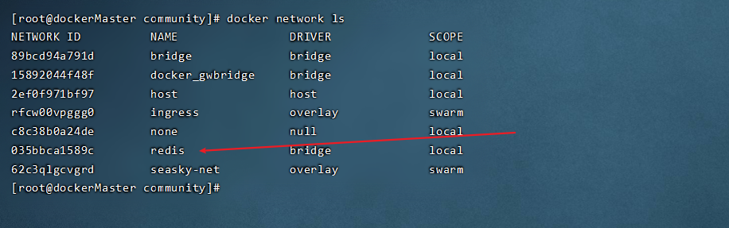
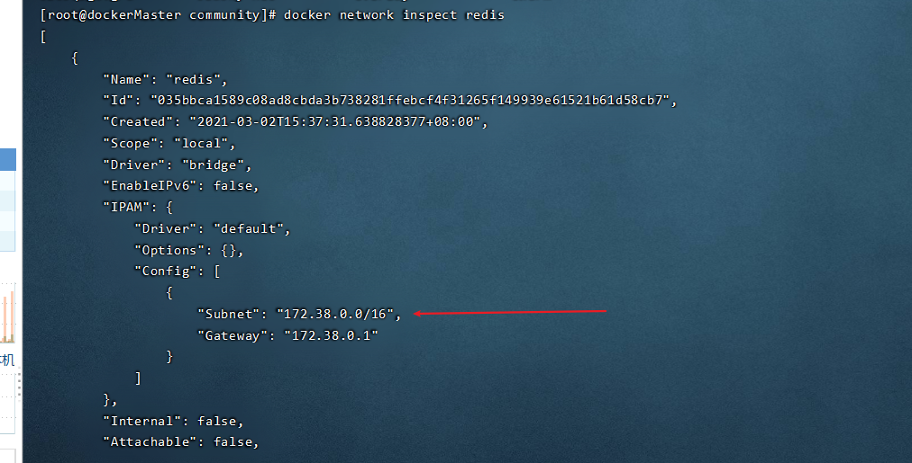
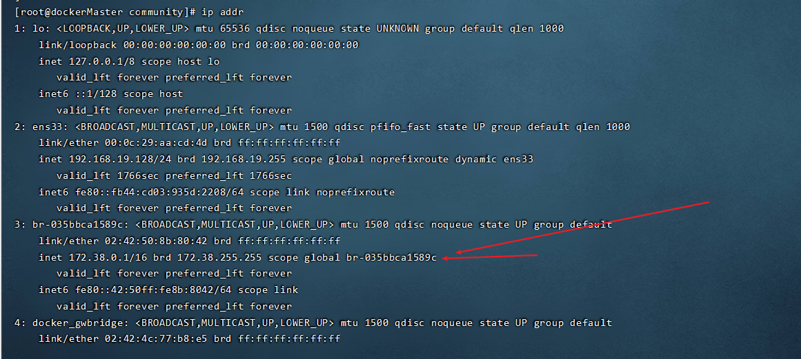

# docker容器访问宿主机端口不通-解决办法 
场景 ： docker，java项目容器，mysql容器，两个容器是同一个自定义网络
Java项目容器内不能访问 mysql数据库，telnet mysql的IP 端口  不通
navicat可以访问  mysql的IP 端口

分析：
经排查发现，该服务器启用了防火墙，防火墙把3306的端口的访问授权给docker0网卡访问即可。

解决： 
```aidl

firewall-cmd --permanent --zone=trusted --change-interface=docker0

firewall-cmd --reload
```

此处的docker0是docker的默认网卡 ，我们要找到自定义网络的网卡，然后授权
1. 先找到我们自己的网络的信息

```aidl
 docker network ls
```

2. 找到对应网卡的网段
```aidl
docker network inspect redis
```

3. 找到所有的网卡信息，找到自己的网卡 
```aidl
ip addr
```


4. 复制解决办法的命令，替换网卡名即可
```
firewall-cmd --permanent --zone=trusted --change-interface=br-035bbca1589c

firewall-cmd --reload
```

5. 验证是否解决 
```aidl

telnet ip 端口
```